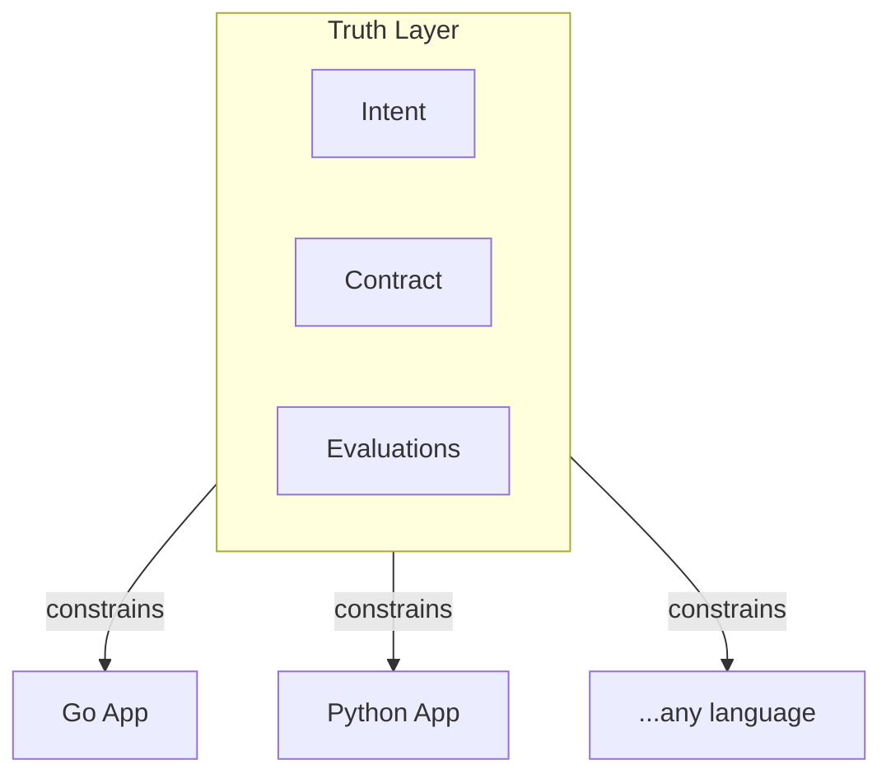
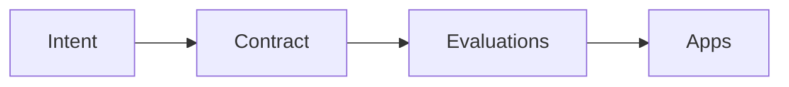
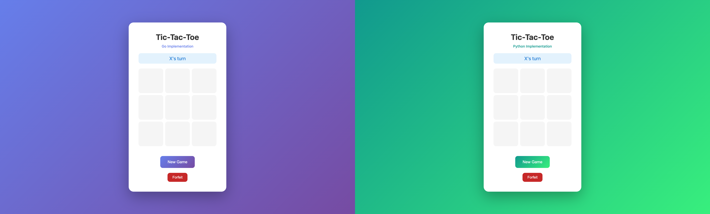

# Code Was Never the Asset: A Proof-of-Concept for AI-Era Architecture

In January 2023, Andrej Karpathy tweeted: "The hottest new programming language is English."

Most developers interpreted this as: write better prompts to AI. But there's a deeper reading. What if English specifications *are* the durable artifact, and code becomes a rendering—generated, validated, and regenerated as needed?

Chad Fowler articulated this shift precisely in his Phoenix Architecture thesis: "Writing code stopped being the hard part." And more provocatively: "Evaluations are the real codebase."

I wanted to test this idea with something concrete. So I built a tic-tac-toe game—but in a specific way. I wrote the truth layer first: the intent document, the API contract, the executable evaluations. Then I generated implementations in Go and Python. Both pass the same 47 invariant tests.

The code is different. The identity is identical.

---

## The Problem

Traditional software has no clean separation between "what the system is" and "how it's built."

Business rules scatter across code, tests, comments, and tribal knowledge. The same rule gets implemented differently in different places. When a developer asks "what must always be true about this system?", the answer requires archaeology—digging through code, tests, and documentation hoping they agree.

Consider a common scenario: a fintech company has a rule that transfers over $10,000 require additional verification. Where does that rule live? In the backend validation? The frontend form? The mobile app? The database constraints? In practice, it lives in all of them—implemented slightly differently each time, with different edge case handling, different error messages, and different assumptions about what "additional verification" means.

When requirements change, developers must hunt through multiple codebases to update the rule consistently. When they miss one, the system develops subtle inconsistencies that manifest as bugs, security holes, or user confusion.

This isn't a tooling problem. It's an architectural one. We've conflated "the system" with "the code that implements the system."

We've always known code isn't the asset. The asset is the business logic, the constraints, the invariants. Code is just one expression of those things. AI gives us economic pressure to finally act on this insight.

When generating code approaches zero marginal cost, specifications become the primary asset—not documentation of the asset. The economics have shifted: human attention is scarce and expensive; code generation is abundant and cheap. We should invest human attention in what matters most—specifying correctness—and let generation handle the rest.

---

## The Specification Heritage

This idea isn't new. It synthesizes decades of prior art.

**Gojko Adzic's "Specification by Example"** taught us that executable specifications serve as living documentation. His insight was subtle but powerful: examples aren't just illustrative—they're definitional. When you write "given a new game, when O moves first, then the move is rejected," you've written both documentation and a test. The specification and the verification are the same artifact. This eliminates the drift problem: specifications can't get out of sync with tests because they *are* the tests.

**Dan North's BDD** gave us Given/When/Then—a structured language for expressing behavior that both humans and machines understand. BDD solved the communication problem between business stakeholders and developers. Instead of developers translating requirements into technical tests, the requirements themselves become executable. The business person who writes "given an in-progress game, when a player makes three in a row, then they win" has written something a test framework can run directly.

**Eric Evans' "Ubiquitous Language"** insisted that domain terms appear identically in code, tests, and conversation. If the business calls it a "forfeit," the code should have a `Forfeit` type, the tests should say `forfeit(game_id, player)`, and conversations should use the same term. No translation layer between business and implementation means fewer misunderstandings and faster iteration.

**Bertrand Meyer's "Design by Contract"** formalized the idea of invariants, preconditions, and postconditions. Systems don't just do things—they *guarantee* things. A bank transfer doesn't just move money; it *guarantees* that the total money in the system remains constant. These guarantees are the actual requirements; everything else is implementation detail.

What's new isn't the concepts. What's new is the economics.

When code generation is nearly free, specifications become the primary asset—not documentation of the asset. The truth layer synthesizes these approaches:

- Intent documents use ubiquitous language
- Scenarios use Adzic's tabular examples
- Evaluations are executable specifications
- Contracts are design by contract for APIs

This synthesis creates something greater than its parts: a layer of artifacts that survives implementation replacement.

---

## The Truth Layer Concept

A truth layer separates what the system *is* from how any particular implementation expresses it.

It has three components:

**Intent documents** capture what the system IS in binding English. Not documentation. Not comments. Binding claims about system identity. If an implementation violates them, the implementation is wrong.

**Contracts** define external promises. In our case, an OpenAPI specification that any implementation must honor. These are the observable behaviors that users and other systems depend on.

**Executable evaluations** are tests that define valid behavior. But they're written against the truth layer, not against a specific implementation. Any implementation that passes the evaluations is correct by definition.



The truth layer constrains all implementations equally. It doesn't care if you wrote the code by hand, generated it with AI, or trained a model to produce it. If it passes the evaluations, it's valid.

This is a significant shift in how we think about correctness. In traditional development, correctness means "the tests pass and the code does what we think it should." In truth layer development, correctness means "the evaluations pass"—full stop. The evaluations *define* correctness. There's no separate standard.

This has implications for code review. Instead of asking "does this code correctly implement the requirement?", reviewers ask "do the evaluations capture the requirement correctly?" Once the evaluations are right, any implementation that passes them is correct by definition. The code review focus shifts from implementation details to specification quality.

---

## What Intent Documents Look Like

Here's an excerpt from the tic-tac-toe intent document:

```markdown
## Invariants

### Turn Order
- X always moves first
- Players must alternate turns
- A player cannot move twice consecutively
- Only the current player may make a move

### Win Conditions
- Three identical marks in a horizontal row wins
- Three identical marks in a vertical column wins
- Three identical marks in a diagonal wins
- The first player to achieve a winning condition wins the game

### Game Termination
- Once a game is won, no further moves are allowed
- Once a game is drawn, no further moves are allowed
- The game outcome (winner or draw) is immutable after termination
```

Notice the language: "must", "cannot", "always". These aren't suggestions. They're binding claims about system identity.

If an implementation allows O to move first, that implementation is wrong—regardless of how clever or performant it might be. The intent document defines correctness; implementations must conform.

This is fundamentally different from documentation. Documentation describes what code does. Intent documents prescribe what code *must* do.

---

## From Intent to Executable Evaluation

Intent becomes enforceable through evaluations. Here's how a tabular scenario translates to an executable spec:

**Scenario table (Gojko Adzic style):**

| move_number | player | expected |
|-------------|--------|----------|
| 1           | X      | accepted |
| 1           | O      | rejected |
| 2           | O      | accepted |

**Executable evaluation:**

```ruby
describe "first move" do
  it "rejects O moving first" do
    game = create_game
    response = make_move(game["id"], 0, 0, "O")

    expect(response.status).to eq(400)
    expect(response.body["error"]).to eq("not_your_turn")
  end
end
```

This isn't a test in the traditional sense. It's an *evaluation*: a binding statement of what must be true. The evaluation doesn't know or care which implementation it's running against. It only knows the contract.

Run it against Go: pass. Run it against Python: pass. Run it against a future Rust implementation: if it passes, it's correct.

---

## Two Implementations, One Truth

Here's the same invariant—checking if it's the player's turn—in both implementations:

**Go:**
```go
func (g *Game) Move(row, col int, player Player) error {
    if player != g.currentPlayer {
        return ErrNotYourTurn
    }
    // ...
}
```

**Python:**
```python
def move(self, row: int, col: int, player: Player) -> None:
    if player != self.current_player:
        raise NotYourTurn()
    # ...
```

The implementations are structurally different. Go uses error returns; Python uses exceptions. Go has explicit types; Python uses dataclasses. The HTTP frameworks differ entirely.

But both pass the same 47 evaluations:

| Implementation | Framework | Evaluations |
|----------------|-----------|-------------|
| Go             | net/http  | 47/47       |
| Python         | FastAPI   | 47/47       |

Two implementations are enough to prove the point. The pattern extends to any language. Add Rust, add JavaScript, add whatever—if it passes the evaluations, it's a valid expression of the truth layer.


*Two implementations, same truth layer. The Go version (purple gradient, left) and Python version (green gradient, right) have different visual styles but identical behavior.*

---

## The Forfeit Feature: Truth Changes First

The real test of this architecture is evolution. Can you add features without breaking the separation of concerns?

I added a forfeit feature. Here's the workflow:

**Step 1: Update Intent**

```markdown
### Forfeit
- A player may forfeit only during their turn
- A player may forfeit only while the game is in progress
- On forfeit, the forfeiting player loses immediately
- On forfeit, the opponent wins immediately
- Forfeit ends the game — no further moves are allowed
- The game outcome must indicate forfeit (status: "x_forfeits" or "o_forfeits")
```

**Step 2: Update Contract**

```yaml
/game/{gameId}/forfeit:
  post:
    summary: Forfeit the game
    description: |
      Current player forfeits the game, immediately losing.

      Invariants enforced:
      - Only the current player may forfeit
      - Game must be in progress
      - Opponent wins immediately upon forfeit
```

**Step 3: Write Evaluations**

```ruby
describe "Forfeit" do
  it "allows current player to forfeit" do
    game = create_game
    response = forfeit(game["id"], "X")

    expect(response.status).to eq(200)
  end

  it "rejects forfeit from non-current player" do
    game = create_game
    response = forfeit(game["id"], "O")

    expect(response.status).to eq(400)
    expect(response.body["error"]).to eq("not_your_turn")
  end

  it "declares opponent as winner when X forfeits" do
    game = create_game
    response = forfeit(game["id"], "X")

    final_game = response.body
    expect(final_game["status"]).to eq("x_forfeits")
    expect(final_game["winner"]).to eq("O")
  end
end
```

**Step 4: Run Evaluations (They Fail)**

```
8 examples, 8 failures
```

Good. The evaluations fail because no implementation has the forfeit endpoint yet. This is TDD at the architecture level.

**Step 5: Update Implementations**

Now—and only now—update Go and Python to implement the forfeit endpoint. The implementations can be different; they just need to pass the evaluations.

**Step 6: Run Evaluations (They Pass)**

```
47 examples, 0 failures
```



Notice what hasn't happened: no implementation code was written before the truth layer changed. The workflow is always: truth first, then implementations catch up.


*Both implementations now have the forfeit feature. The truth layer changed first; the implementations followed.*

---

## Pace Layers

Not all parts of a system change at the same rate. The truth layer architecture acknowledges this through pace layers.

**Slow layer**: System identity. The truth layer lives here. Changes require ceremony—explicit justification, review, understanding of downstream impact. This is where "oops I accidentally changed business rules" is prevented.

**Fast layer**: HTTP handlers, views, serialization. Regenerate freely. These are expressions of truth, not truth itself. If you delete them and regenerate, the system identity remains unchanged.

The governance is simple: slow-layer changes require explicit approval. Fast-layer changes can be autonomous.

This prevents a subtle failure mode: smuggling slow-layer changes inside fast-layer work. When someone says "I just refactored the validation," the pace layer classification forces the question: did you change *what's validated* (slow) or *how validation is expressed* (fast)?

---

## Honest Limitations

Is tic-tac-toe too simple? Let me address this directly.

**What transfers**: The pattern scales. "A player may only move on their turn" is structurally identical to "transfers must be atomic" or "users cannot access resources outside their organization." Domain complexity increases the *number* of invariants, not the *structure* of enforcement. An e-commerce system might have hundreds of invariants spanning inventory management, payment processing, and fulfillment. But each individual invariant has the same shape: a binding claim about what must be true, expressed in English, validated through executable evaluation.

**What gets harder**: Complex systems have more interacting invariants. A move in tic-tac-toe affects only game state. A transaction in a payment system affects account balances, audit logs, notification queues, and potentially external systems. The truth layer doesn't eliminate that complexity—it just gives it a proper home.

Real systems also have performance constraints that pure specification can't capture. "Queries must return in under 100ms" is an invariant, but validating it requires production-like environments and realistic data. The truth layer handles behavioral correctness well; performance correctness requires additional infrastructure.

**The integration challenge**: The trickiest aspect of real systems is third-party integration. Your truth layer can specify "when a payment succeeds, record the transaction," but the definition of "payment succeeds" depends on Stripe's API contract, not yours. External dependencies create boundaries where your truth layer must interface with someone else's contract.

**What this proves**: The value of a truth layer is proportional to the number of implementations it governs. Two implementations demonstrate the concept. For organizations with iOS, Android, web, and API implementations that must all enforce the same business rules—the leverage is real. Each additional implementation that shares the truth layer is an implementation you don't need to manually verify against business rules.

The question isn't whether tic-tac-toe is trivial. The question is whether separating "what the system is" from "how it's built" creates genuine architectural value. The answer is yes, regardless of domain complexity.

---

## Closing

Chad Fowler's Phoenix Architecture makes a specific prediction: if AI regenerates code cheaply, the durable artifacts are those that can be evaluated.

This proof-of-concept demonstrates one way to act on that prediction. The truth layer—intent documents, contracts, executable evaluations—survives implementation replacement. The Go and Python implementations are different expressions of the same system identity.

If I deleted both implementations and regenerated them tomorrow, the system would be identical. Because the truth layer didn't change.

The implications for software teams are significant. Today, we hire developers primarily to write code. Tomorrow, we might hire them primarily to write specifications—to articulate precisely what systems must guarantee. The job shifts from "make it work" to "define what working means."

This doesn't mean coding skills become irrelevant. Someone needs to understand implementations well enough to write meaningful specifications. Someone needs to debug when evaluations fail. Someone needs to make architectural decisions about how truth is enforced. But the center of gravity shifts from code production to specification quality.

The implementations are not the asset. They're expressions of an asset.

The asset is the truth layer.

---

*Credit: This architecture builds on Chad Fowler's Phoenix Architecture thesis and synthesizes decades of specification heritage from Gojko Adzic, Dan North, Eric Evans, and Bertrand Meyer.*

*The working proof-of-concept is available at: [github.com/billeisenhauer/intent-starter](https://github.com/billeisenhauer/intent-starter)*
